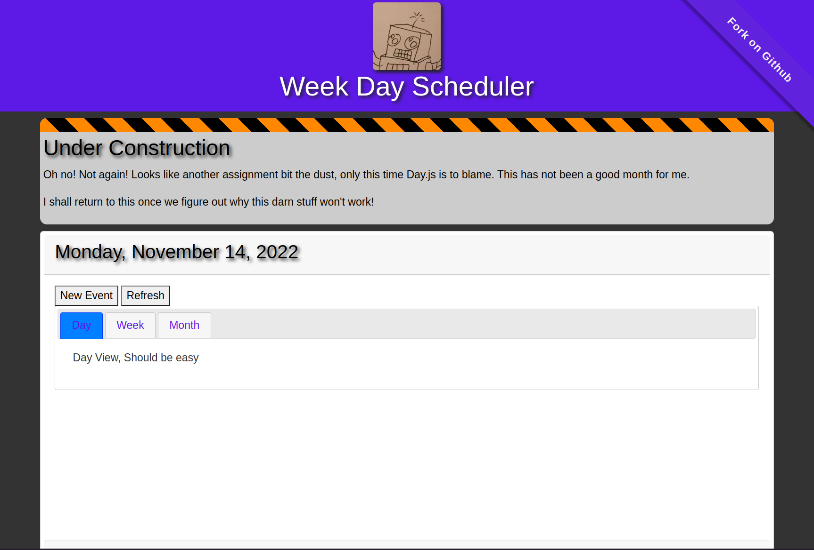

# Work Day Scheduler

Module 5 Challege

[](https://jrcharney.github.io/work-day-scheduler/)

## Your Task

Create a simple calendar application that allows a user to save events for each hour of the day by modifying starter code. This app will run in the browser and feature dynamically updated HTML and CSS powered by jQuery.

You'll need to use the [Day.js](https://day.js.org/en/) library to work with date and time. Be sure to read the documentation carefully and concentrate on using Day.js in the browser.

## User Story

```
AS AN employee with a busy schedule
I WANT to add important events to a daily planner
SO THAT I can manage my time effectively
```

## Acceptance Criteria

```
GIVEN I am using a daily planner to create a schedule
WHEN I open the planner
THEN the current day is displayed at the top of the calendar
WHEN I scroll down
THEN I am presented with timeblocks for standard business hours
WHEN I view the timeblocks for that day
THEN each timeblock is color coded to indicate whether it is in the past, present, or future
WHEN I click into a timeblock
THEN I can enter an event
WHEN I click the save button for that timeblock
THEN the text for that event is saved in local storage
WHEN I refresh the page
THEN the saved events persist
```

## TODO List

Deadline: 11/14/2022

* [x] ~~Install Node.js~~ Probably should not have done this.
* [x] Install Day.js
    - LOOK FOR THE PLUGINS ON THE CDN!
* [x] Install Bootstrap
* [x] Install jQuery and jQueryUI
* [x] When opening this application, show the current day at the top of the calendar.
* [ ] When scrolling down, show timeblocks for standard business hours
* [ ] When viewing the timeblocks for the day, each timeblock should be color coded to indicate wheter it was in the past, present, or future.
    - Google Calendar typically grays out past events
* [ ] When clicking a timeblock, open the event.
* [ ] When clicking the save button for the timeblock, the text for the event is saved in `localStorage`.
    - Timewarrior stores events in a file, probably should follow that as an example.
* [ ] When the page is refreshed, the saved events persist.

I think I should have used Vite to start this project.
